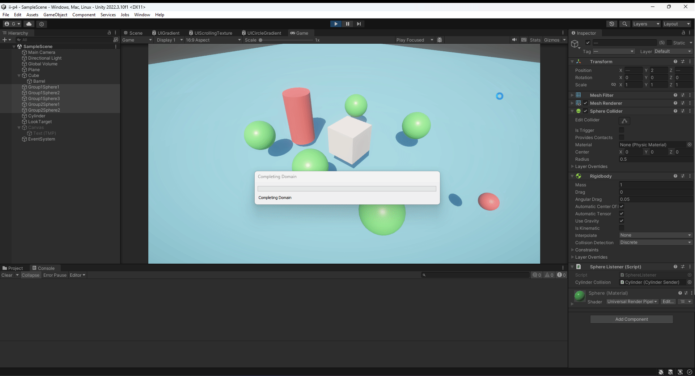
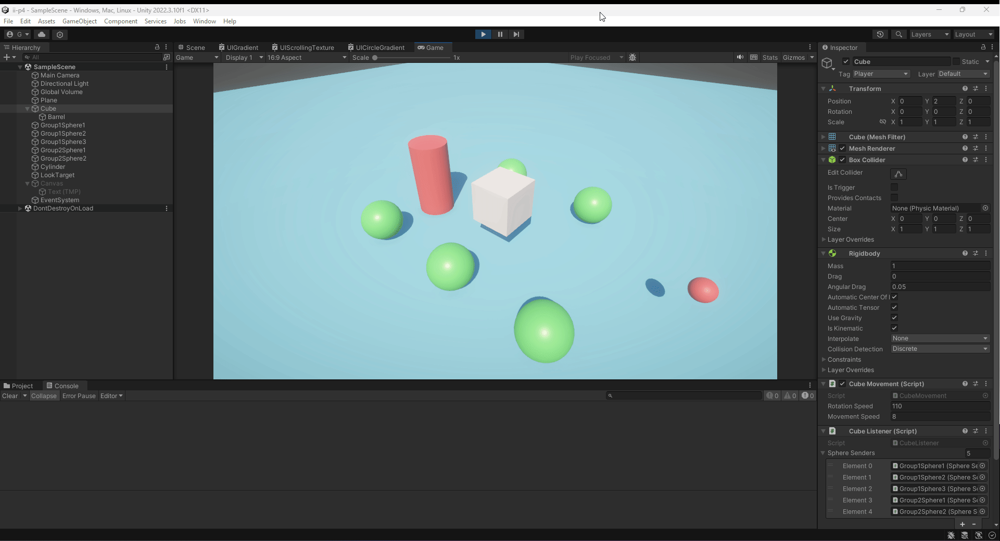
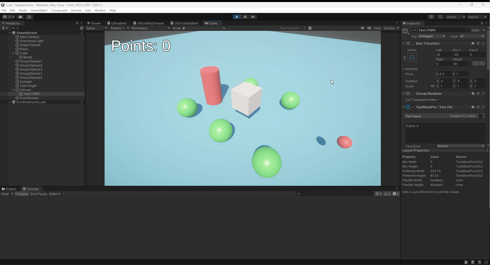

# Interfaces Inteligentes: Práctica 4
## Eventos
### Ginés Cruz Chávez
Práctica 4 de la asignatura Interfaces Inteligentes: Eventos

Para cada ejercicio, se mostrará su enunciado junto con un GIF que muestra el funcionamiento del ejercicio, además de un enlace al script de ese ejercicio.

### Ejercicio 1
* A partir de la escena que has estado utilizando en las últimas prácticas, crea la siguiente mecánica. Cuando el cubo colisiona con el cilindro, las esferas de tipo 1 cambian su color y las esferas de tipo 2 se desplazan hacia el cilindro.

[CubeMovement.cs](scripts/CubeMovement.cs)

[CylinderSender.cs](scripts/Exercise1/CylinderSender.cs)

[SphereListener.cs](scripts/Exercise1/SphereListener.cs)

### Ejercicio 2
* Adapta la escena anterior para que:
Cuando el cubo colisiona con cualquier objeto que no sean esferas del grupo 1, las esferas en el grupo 1 se acercan al cilindro. Cuando el cubo toca cualquier esfera del grupo 1, las esferas del grupo 2 aumentan de tamaño.

[CubeSender.cs](scripts/Exercise2/CubeSender.cs)

[SphereListener.cs](scripts/Exercise2/SphereListener.cs)

### Ejercicio 3
* Cuando el cubo se aproxima al cilindro, las esferas del grupo 1 cambian su color y saltan y las esferas del grupo 2 se orientan hacia un objeto ubicado en la escena con ese propósito.

[CubeSender.cs](scripts/Exercise3/CubeSender.cs)

[SphereListener.cs](scripts/Exercise3/SphereListener.cs)

### Ejercicio 4
* Implementar la mecánica de recoger esferas en la escena que actualicen la puntuación del jugador. Las esferas de tipo 1 suman 5 puntos y las esferas de tipo 2 suman 10. Mostrar la puntuación en la consola.

[CubeListener.cs](scripts/Exercise4/CubeListener.cs)

[SphereSender.cs](scripts/Exercise4/SphereSender.cs)

### Ejercicio 5
* Partiendo del script anterior crea una interfaz que muestre la puntuación que va obteniendo el cubo.

[CubeListener.cs](scripts/Exercise5/CubeListener.cs)

[SphereSender.cs](scripts/Exercise5/TextListener.cs)

### Ejercicio 6
* Genera una escena que incluya elementos que se ajusten a la escena del prototipo y alguna de las mecánicas anteriores.

Se ha generado una escena con las esferas coleccionables, y una cámara que sigue al jugador con una vista desde atrás. Para hacerlo más visual, también se ha añadido un terreno.

